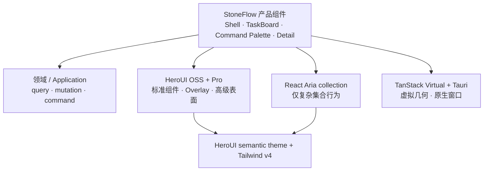

# HeroUI-only UI 平台、Linear 浅色设计系统与键盘交互重写 - Plan

## 方案概述

### 推荐结论

终态采用一套明确的 UI 技术栈：

- **组件与标准交互**：HeroUI OSS v3 + HeroUI Pro。
- **底层集合能力**：React Aria / React Stately 的 collection hooks 与 `SelectionManager`；只在 TaskBoard 等 HeroUI 高层组件无法表达的集合中直接使用。
- **样式系统**：Tailwind CSS v4 + HeroUI semantic theme + 一份集中式 HeroUI 组件状态配方。
- **动画策略**：StoneFlow 不编写或消费 Motion 动画；删除第一方动画，HeroUI OSS/Pro 包内自带动效作为唯一组件动效来源。供应商安装若要求动画依赖则按官方合同精确锁定。
- **产品状态**：StoneFlow 继续拥有路由、Command Registry、领域 mutation、设备偏好与 TaskBoard 虚拟几何。
- **终态清理**：Radix、shadcn、cmdk、Sonner、react-day-picker、CVA、StoneFlow 对 `tw-animate-css` 的直接依赖/导入，以及旧 base/pattern/token/adapter 在零消费者后全部删除。

这里的“完全切到 HeroUI”指：所有可由组件库表达的标准控件、表单、导航、浮层、反馈和高级表面都由 HeroUI 提供。React DOM、Tailwind 布局、TanStack Virtual、Tauri 平台 CSS 与 StoneFlow 产品组合不是第二套组件库。



产品组件同时依赖应用/领域接口和 UI/平台基础设施；领域与应用层不得反向依赖产品组件或 HeroUI。HeroUI 类型不得穿透到领域命令、查询、mutation 或持久化接口，产品组件可以组合 HeroUI，但不镜像 HeroUI 的 primitive API。

### 五个长期合同

1. HeroUI semantic theme 是 UI 颜色、圆角、阴影、焦点与状态皮肤的唯一真相。
2. 每个键盘集合只有一份 React Aria collection state；业务 selection snapshot 是执行时只读投影。
3. Command Registry/Runtime 是快捷键、可用性、目标与执行入口的唯一真相。
4. URL 拥有当前 `?task=` 详情意图，Detail Host 只按窗口 `1024px` 边界派生 Aside/Sheet 容器，详情 controller 拥有编辑草稿；完整页只由显式动作进入。
5. HeroUI 官方动效是唯一组件动效合同；StoneFlow 不维护组件级动画、时间 token、Motion 封装或 feature 动效例外。

### 迁移原则

- 采用可构建的纵向切片；未迁移表面可以短期继续运行旧实现，但已迁移表面不得再导入旧 base、pattern 或 `--sf-*`。
- 不在旧路径重导出 HeroUI，不建立运行时 feature flag、双实现同步或兼容 adapter；回滚依赖 Git。
- 每个切片直接落到新版视觉与交互，不做“先换库保留旧皮肤、再重画一次”的双重工作。
- 删除以零消费者、零依赖和零样式引用为判据，不按目录名盲删真实产品组件。
- 动画先做一次全仓 hard cut，后续迁移任务只验证不重新引入；几何调度与焦点调度不按动画误删。

## 备选方案与取舍

| 决策 | 采用 | 放弃 | 原因 |
|---|---|---|---|
| UI 平台 | HeroUI OSS + Pro | shadcn Aria、HeroUI/shadcn 混搭 | 避免两套 RAC wrapper、token、variant 与 overlay 体系 |
| 样式引擎 | Tailwind CSS v4 | StyleX | HeroUI 原生依赖 Tailwind；StyleX 会引入第二条样式编译链但不能提高最终视觉上限 |
| 主题架构 | 直接覆盖 HeroUI semantic variables | `StoneFlow token → HeroUI token` 映射 | 删除旧别名链，让组件库主题成为唯一视觉真相 |
| 组件定制 | theme + 一份集中式组件 recipe | 零覆盖承诺、feature 私有皮肤 | HeroUI 默认无法分别表达已确认的 Outline/Button 与 Sidebar 三态；集中覆盖是最小必要出口 |
| 组件使用 | 直接导入 HeroUI，产品语义才封装 | 为每个 primitive 建 `shared/ui` wrapper | 透传 wrapper 只增加层数，并不能降低供应商锁定 |
| Shell | HeroUI Sidebar/Sheet + 单一产品 resize rail | HeroUI AppLayout/Resizable 强套、继续旧 shadcn Shell | HeroUI 的 icon collapse 与内建 resize 不兼容，Handle 也不支持同一区域 click/drag；产品几何例外更符合已确认三态 |
| TaskBoard | React Aria collection + 现有 TanStack Virtual | Pro ListView 全量替代、继续旧键盘状态机 | ListView 未承诺分组 sticky、服务端总高度和外部定位；TanStack 只保留几何职责 |
| 普通集合 | 优先 Pro ListView / HeroUI ListBox、Table | 所有列表一律低层 hooks | 简单集合不值得自建行为层；只有 Linear 键位或特殊几何不够时才下沉 |
| 任务详情 | `>=1024px` HeroUI Pro Resizable Aside，`<1024px` HeroUI Sheet | 用户呈现偏好、额外的局部宽度分流、响应式导航完整页 | 与 Sidebar 共用一份 `isCompact`、分开拥有 open state；跨断点只换容器，不改 `?task=` 或草稿 |
| 通知与日期 | HeroUI Toast、Calendar/DatePicker | Sonner、react-day-picker | 完成 HeroUI-only，减少两套视觉与焦点行为 |
| 动画 | 保留 HeroUI 官方动效 + StoneFlow 第一方零动画 | 本轮引入 Motion、保留零散 CSS transition、全局禁用 HeroUI 动效 | 用户要删除自写动画而不是移除组件库原生反馈；未来自定义动效独立设计 |
| 迁移方式 | 分阶段纵向 hard cut | 一次性删除后长时间不可构建、长期双轨 | 每阶段可验证，同时确保终态无兼容残渣 |

不采用 AppLayout 不是因为它缺少 Header、Footer、Aside 或 resize，而是因为这次已经确认的 Sidebar 同时要求 icon rail 与同一条 rail 的点按/拖宽，且主窗口还有全宽 Tauri Header/Footer、Launcher 和特殊虚拟滚动所有权。HeroUI `sidebarResizable` 不兼容 icon，`Resizable.Handle` 也没有公开 click/drag 阈值 API；因此 Shell 不强用 Resizable，只保留一处明确登记的产品几何 rail。这比覆盖组件内部行为更少、更稳定。

## HeroUI 依赖、供应链与资料真相

### 版本与安装

- 当前计划基线为 HeroUI OSS `3.2.4`、HeroUI Pro React `1.0.0-beta.8`、React Aria Components `1.20.0`、`react-aria 3.51.0` 与 `react-stately 3.49.0`；后两者作为 TaskBoard 低层 collection/selection 的直接精确依赖，不依赖 HeroUI 的传递安装。全部直接依赖固定为经过验证的精确版本。
- React 保持 19，Tailwind 保持 v4。HeroUI v3 不需要 `HeroUIProvider`。
- StoneFlow 源码不 import、调用或封装 `motion` / `framer-motion`。如果锁定版 HeroUI 官方安装合同要求动画 peer/direct dependency，则可精确锁定为供应商实现依赖，但不暴露给产品代码；`tw-animate-css` 从 StoneFlow 直接声明和样式入口删除，lockfile 只对 HeroUI 官方链路做精确 allowlist，不要求物理清除该包。
- 只有真实采用 Pro Resizable 的非 Sidebar 分栏才从 `@heroui-pro/react/resizable` 导入；其余组件使用各自公开入口，不建立统一 barrel。
- 组件交互使用 HeroUI/React Aria 的 `onPress`；只有拖拽、原生窗口和虚拟滚动等底层几何直接处理 pointer/scroll 事件。
- 供应链预检先在仓库外隔离临时目录验证固定版 `hpsetup` 能取得或从固定版本缓存恢复锁定 Pro 包并记录树 SHA-256；精确依赖写入项目后，在全新隔离目录完成 frozen install、typecheck 和生产构建。缓存回退本身不阻塞产品实现，树哈希不符或隔离构建失败才停止后续迁移。

### CollectUI 供应链

- 本地与 CI 的安装固定执行 `bunx hpsetup@4.7.0 --auto`，通过进程环境注入 `HEROUI_KEY` 并允许复用固定版本缓存。T8/T110 复核隔离安装、树 SHA-256、frozen install、类型检查与生产构建，不要求源站绕过缓存成功。Key 只存在于本机 secret store 或 CI encrypted secret，不写入命令参数、客户端环境、预览变量、仓库 `.npmrc`、日志、lockfile 或应用产物。
- `@heroui-pro/react` 固定为 `1.0.0-beta.8`。阶段 A 的脱敏证据写入 `Documents/99-素材/03-验证/heroui-refactor/supply-chain-smoke.json`；升级时同步更新安装器版本、Pro 版本、文件数、解包字节数、`package.json` SHA-256 与树 SHA-256。
- Bun `trustedDependencies` 只接受当前 Pro 运行或安装实际必需且经 diff 复核的最小集合；不得因为隔离 smoke 被 `hpsetup` 写入了 `@zowe/secrets-for-zowe-sdk` 就照搬到主项目，也不扩大为通用 postinstall 白名单。
- 本方案只验证 CollectUI 工作流可取得指定包及其完整性，不将其表述为 HeroUI 官方 license、owner、seat、entitlement 或 Updates Window 的证明。
- 本仓库只接受集成后的 StoneFlow 正常应用构建产物；不得复制、提交或再分发 Pro 组件源码、模板、私有 CDN 响应和解包资产，此边界不代表对第三方许可状态作出判断。
- Pro 升级独立进行：复核新版 `hpsetup` 源码与变更、读取匹配版本 release notes、更新精确版本与树 SHA-256，并完整执行本方案的关键交互矩阵。

### MCP 与 Skills

- Pro unified MCP 作为 OSS + Pro 当前组件、文档、CSS 与主题能力的发现入口；普通 `heroui-react` MCP 默认停用，避免重复工具与版本噪音。
- 组件 API 和运行行为以锁定包的 exports、TypeScript types 与测试为准；current MCP 可能领先锁定版本，静态 Skill 也可能滞后。
- `heroui-react-pro` 用于实现流程；`heroui-pro-design-taste` 只提供视觉审查启发，不得覆盖本 SPEC 的高密度、色值与行为合同。
- 不调用 Chat/Saved Design System 导入能力，除非任务发起人另行提供明确 ID 并授权；它们不是本迁移的实现真相。

## 样式系统终态

### 文件与导入

终态全局样式只保留五个职责清晰的文件：

```text
src/styles/
├── index.css       # 唯一样式入口与 import 顺序
├── fonts.css       # Inter Variable 和系统 fallback
├── theme.css       # HeroUI semantic variables
├── components.css  # 少量全局 HeroUI 状态 recipe
└── base.css        # document/root/Tauri/Launcher 真全局规则
```

`index.css` 顺序固定为：

```css
@import "tailwindcss";
@import "@heroui/styles";
@import "@heroui-pro/react/css";
@import "./fonts.css";
@import "./theme.css";
@import "./components.css";
@import "./base.css";
```

主窗口和 Launcher 的根元素统一设置 `class="light" data-theme="stoneflow-light"`，主题块显式声明 `color-scheme: light`；不监听系统暗色，也不注册另一套 theme。HTML boot shell 在 React 挂载前使用同一浅色合同。不得在根节点强制设置 `data-reduce-motion="true"`；HeroUI 按系统偏好处理 reduced motion。阶段 B 原型与阶段 D Shell 必须验证 Sidebar 实际盒宽驱动 `auto` grid 时的折叠同步。

五文件是迁移完成时的终态。迁移期 `index.css` 可以继续导入尚有消费者的 legacy 样式，但新 theme 不读取旧 `--sf-*`、旧组件也不反向读取 HeroUI token；legacy import 随最后一个消费者删除，阶段 M 才收敛到上述五文件。

终态不保留 `primitive.css`、`semantic.css`、`layout.css`、`dark.css`、shadcn adapter、CSS Module、feature theme 文件或纯 class-string pattern 文件。`no-scrollbar` 等确实全局且只有一条规则的例外直接放在 `base.css`，不再为它增加第六层文件。

### 主题映射

精确 HEX 与对比度由 SPEC 的“Linear-inspired 浅色视觉、色彩合同与字体”章节唯一维护；PLAN 只定义如何落入 HeroUI：

| SPEC 语义 | HeroUI 终态 |
|---|---|
| `main` / 主文字 | `--background` / `--foreground` |
| `surface-raised` | `--surface`、`--overlay` 与对应 foreground |
| `shell` | `--surface-secondary`，Shell/Sidebar 根使用同一语义 |
| Main hover | `--surface-hover` |
| 次级文字 | `--muted` |
| 普通边界 | `--border`、`--separator`，按是否是控件边界区分 |
| Accent / 键盘焦点 | `--accent`、`--focus` |
| 表单状态 | `--field-*` 与 HeroUI invalid/disabled 状态 |
| Success / Warning / Danger | HeroUI 对应 semantic status |
| Info | 在 HeroUI theme 中增加唯一的 `info` semantic extension |
| 实体颜色 | feature 数据值，不进入 UI 主题 ramp |

直接使用已确认 HEX，不为“看起来更现代”转换成会产生取整漂移的 OKLCH 数值。HeroUI 自动计算的 hover/pressed 若不等于已确认合同，则显式覆盖对应公开变量。

### 唯一组件 recipe 出口

`components.css` 只允许三类全局规则：

1. HeroUI semantic token 无法区分的 Outline/Raised Button hover 与 pressed/open 状态。
2. Sidebar item 的 hover 与 current 状态，以及 Shell chrome 内的 Button 表面上下文。
3. 本方案明确需要的紧凑密度、公开 BEM/data-state 修正，以及仅在 Sidebar 实时拖拽期间关闭 HeroUI 官方 width/label transition 的状态规则。

规则必须在 `[data-theme="stoneflow-light"]` 或 Shell surface scope 下，通过锁定版本公开的 BEM/data-state 和组件 CSS 变量实现。禁止使用生成后的 hash、DOM 层级猜测、`!important` 链或 feature 选择器。锁定版本没有稳定公开 selector 时，改用该组件公开 `className`/slot API；不再增加 wrapper 来藏覆盖。

`components.css` 不得创建 transition、animation、keyframe、duration 或 easing，也不得重写 HeroUI 官方动效。唯一例外是 `[data-resizing="true"]` 期间将 HeroUI Sidebar 自带的 width/label transition 临时设为 `none`，保证 pointer drag 与像素宽度一一对应；pointerup 后立即移除，普通 expanded/icon 切换继续使用 HeroUI 官方 `200ms` 动效。锁定版 HeroUI 的 reduced-motion 合同若实测失败，优先升级到已修复的官方版本；不预埋 feature 级补丁。

普通组件优先使用 `size="sm"`、HeroUI variant 和 slots；由于不同组件、不同断点的 `sm` 高度不完全一致，`28–32px` 合同必须逐组件验收，并只在 `components.css` 的集中 recipe 中覆盖。TaskBoard 行和分组标题的最终高度由产品几何常量统一提供。feature 不手写第二套 Button/Input/Menu 皮肤。

### 字体与平台规则

- 本地打包 Inter Variable WOFF2，使用其 OFL 许可；`font-optical-sizing: auto`，UI 字重只使用真实 400/500/600。
- 中文 fallback 固定为 `PingFang SC`、`Microsoft YaHei UI`、`Segoe UI`、`system-ui`、`sans-serif`；代码与快捷键继续系统 monospace。
- 保留 `font-synthesis: none`，删除 Maple Mono 与霞鹜文楷 UI 字体资产和 unicode-range 拼接。
- `base.css` 只保留 `html/body/#root` 高度与 overflow、桌面选择策略、输入区恢复文本选择、Tauri drag region、Launcher 透明窗口和必要滚动条规则。
- 首帧 boot shell 与 Rust 原生窗口背景必须复制 theme 的 shell/main 值，这是 CSS 加载前的跨进程必要重复；用一条静态检查防止三处漂移，不建设 token 生成器。

## 第一方动画清零终态

本轮的目标不是把旧 CSS 动画翻译成 Motion，而是删除整个 StoneFlow 第一方动效层：

- 删除 `tw-animate-css` 的直接依赖/导入、旧 motion token、`animate-*`、`transition*`、`duration-*`、`delay-*`、`ease-*`、`motion-*`、`active:scale-*`、平滑滚动、自有 keyframe、WAAPI 与 View Transition 调用。
- 旧 Radix Overlay 的 fade/zoom/slide 不移植到 HeroUI；StoneFlow 自行控制的 Sidebar/Launcher 几何与行状态即时切换，由 HeroUI 组件呈现的折叠、进度和按压反馈则保留包内官方动效。
- HeroUI 官方 CSS 按包原样导入，其内建进入、退出、按压、折叠、Spinner 与 Progress 动效照常保留；不 fork Pro/OSS 源码，不复制或改写官方 keyframe、duration 与 easing。
- reduced motion 交给 HeroUI 官方 `prefers-reduced-motion` / `motion-reduce` 合同；本任务在 macOS WKWebView 锁版实测关键 Overlay、Sidebar、Toast 与 Progress，不为未实测的 Windows 行为先写兼容层。
- Spinner、Progress、同步与更新状态必须同时提供静态图形或文字及正确的 `aria-busy`、`aria-live`、`role="progressbar"`；动画不可成为状态成立的条件。
- 保留直接拖宽、虚拟滚动、sticky、scrollbar 几何、动态进度值以及挂载后焦点恢复。`requestAnimationFrame` 可以合并 DOM 读写或安排焦点，但不得计算插值帧；静态 `transform` 仍可用于居中、off-canvas 几何和当前展开方向。

实施时增加一个小型 `scripts/check-no-first-party-animation.ts`，只扫描明确的直接依赖、应用 import、CSS 声明和 Tailwind class；它禁止第一方动效语法，允许业务字段中的 `transition_status`、静态 transform 和 `requestAnimationFrame`。rAF 是否被滥用于 tween 通过针对性代码审计和行为测试证明，不维护庞大 allowlist。检查器只配一组最小正反例测试，不建设通用 CSS parser。

## HeroUI 组件采用矩阵

| 现有能力 | 终态组件 | StoneFlow 保留的边界 |
|---|---|---|
| Button、Input、Textarea、Checkbox、Switch、Radio、Select、Autocomplete | HeroUI OSS 对应组件 | 表单 schema、校验、mutation；不保留同名 wrapper |
| Calendar、日期/时间输入 | HeroUI Calendar / DatePicker / DateField | 领域日期值、时区和保存规则；删除 react-day-picker |
| Tooltip、Popover、Dropdown/Menu、Modal、AlertDialog、Tabs、Accordion | HeroUI OSS | 产品文案、确认动作、可用性与 trigger 目标 |
| Toast、ProgressBar/ProgressCircle、Badge、Avatar、Skeleton | HeroUI OSS | 消息内容和业务状态；删除 Sonner 与 Radix Avatar |
| EmptyState | HeroUI Pro | 产品空状态文案与动作 |
| Sidebar、Sheet | HeroUI Pro | 三态、1024px 响应式、宽度和设备偏好由 Shell controller 拥有 |
| Shell resize rail | StoneFlow 产品几何例外 | HeroUI Handle 无法表达同一区域 click/drag；不扩张成通用 Resizable primitive |
| 任务详情 | HeroUI Pro Resizable + HeroUI Sheet | 列表 Panel 最小 `352px`；Aside Panel 最小 `320px`、默认 `360px`、最大 `440px`；窄窗口复用同一详情内容的 Sheet |
| 其他真实分栏 | HeroUI Pro Resizable | 只有现有表面确实需要独立 split pane 时采用；不为组件覆盖率新增用例 |
| Command | HeroUI Pro Command | Registry、Runtime、异步搜索、最近使用、可用性与执行 |
| Context menu | HeroUI Pro ContextMenu | selection 目标解析与领域命令 |
| 批量操作条 | HeroUI Pro ActionBar | selection snapshot、确认、mutation 与反馈 |
| 活动历史 | HeroUI Pro Timeline | query、订阅和领域 display model |
| 普通平面集合 | Pro ListView 或 HeroUI ListBox/Table | 业务实体与动作；Linear 键位集合可接统一 collection adapter |
| TaskBoard | HeroUI 控件外观 + 低层 React Aria Grid/GridList 语义 | TanStack Virtual、分组 sticky、总高度、分页与定位 |
| 普通滚动表面 | HeroUI ScrollShadow 或原生 overflow | 无特殊 viewport 契约时不保留自定义 ScrollArea |
| TaskBoard 滚动表面 | 现有真实 viewport 基础设施，外观改用新主题 | virtualizer ref、sticky 与 native scroll geometry；不叠加第二个 virtualizer |

HeroUI Pro 的 Command、ActionBar、Timeline 只替代 UI 与标准交互，不替代 StoneFlow 业务系统；不会因为组件名相同而删除 Command Runtime、bulk engine 或 activity model。

## Shell、Sidebar 与任务详情

### Shell 结构

不使用 AppLayout。Shell 保留全宽 Tauri Header/Footer 与独立 Launcher 生命周期，在工作区内组合 HeroUI：

```text
Sidebar.Provider (controlled)
└── ShellRoot
    ├── ShellHeader                     # Tauri drag/window controls
    ├── ShellWorkspace (CSS grid)
    │   ├── HeroUI Sidebar              # expanded 220–330 / icon 48
    │   ├── SidebarResizeRail           # 同一区域 click / drag / keyboard
    │   └── HeroUI Sidebar.Main         # 唯一 <main> / Inset surface
    │       └── Workspace + optional Detail Aside
    ├── ShellFooter
    └── compact only: HeroUI Sheet      # 同一导航内容
```

`collapsible="icon"` 与 `variant="inset"` 配置在 HeroUI `Sidebar.Provider`。Provider 包围 Header、Workspace 和 Footer，保证 Header toggle 消费同一 context。HeroUI `Sidebar.Main` 固定作为全页唯一 `<main>` 与 Inset surface；现有 `ShellMain` 重构为透明 Workspace `div`，禁止嵌套 landmark 或双层 Inset。

Shell controller 是目标状态与展开宽度的唯一 Owner，只输出 HeroUI Sidebar 的 `open` 和公开 `--sidebar-width` 目标值。Shell grid 使用由 Sidebar 实际盒宽驱动的 `auto` 轨道，不维护第二份 `48px/expandedWidth` 固定列宽；这样 HeroUI 官方折叠动效与主内容几何来自同一盒模型，不会出现 Sidebar 仍在动而 grid 已瞬间跳完。

不挂载 HeroUI `Sidebar.Rail`，因为它本身是第二个点击 owner。终态保留一个 `SidebarResizeRail` 产品组件：单一 DOM separator 同时判定 click/drag、更新 controller 的 live width 并提交现有设备偏好。它只服务 StoneFlow Shell 的已确认三态，不提供通用 props、不进入共享 primitive 层。

Inset 主工作面只出现一次。Header/Footer 外置导致的高度差异只在 Shell scope 中覆盖 HeroUI 的 `min-h-svh`，不得在 feature 重复修正。`<1024px` 去掉外围 gutter/圆角，桌面保留 8px gutter、柔和圆角和弱边界。

### Sidebar 状态模型

| 状态 | Owner | 持久化 |
|---|---|---|
| `desktopPreference: expanded | collapsed` | 现有设备设置链路 | 是；`collapsed` 的派生视觉名为 icon |
| `expandedWidth: 220..330`，默认 256 | 现有设备设置链路 | pointer/keyboard 提交后持久化 |
| `isCompact: viewport < 1024` | 单个 `matchMedia` source | 否，派生值 |
| `liveWidth` | Resize 交互局部状态 | 否 |
| `mobileSheetOpen` | Shell 瞬时 UI 状态 | 否 |

HeroUI Sidebar 与 Sheet 使用各自公开的 controlled-open props；Shell rail 与 grid 只消费同一个 controller。Sidebar toggle 继续使用现有 `layout.toggleSidebar` command/binding，由 Command Registry 唯一注册，不在本任务新增键位。CSS 只消费 controller 输出的 data attribute，不再独立用第二个 `lg` 断点决定行为。

交互合同锁定为：

- pointer 位移小于 `4px` 视为点按并切换 expanded/icon；达到 `4px` 后进入 drag，只改变展开宽度。icon 状态发生 drag 时先恢复上次 expanded width，再以本次位移继续调整。
- Rail 使用 pointer capture；拖动中只更新 `liveWidth`，pointerup 时钳制到 `220–330px` 并提交一次，pointercancel 恢复 committed width 且不持久化。
- drag 开始时只给 Sidebar scope 设置 `data-resizing="true"`，临时关闭包内 width/label transition；结束或取消时同步移除。该规则只是关闭供应商动效以保证直接操纵，不是 StoneFlow 新动画。
- 同一个 `role="separator"` 通过 `Enter/Space` 切换，`ArrowLeft/Right` 每次 `8px`，`Shift+Arrow` 每次 `24px`，`Home/End` 到 `220/330px`；暴露当前宽度与 expanded/icon 状态，不创建第二个 resize state。
- icon 状态宽度固定 `48px`；重新展开恢复最后提交宽度。
- `<1024px` 时 desktop panel 为 `0` 且不挂载导航内容；受控 HeroUI Sheet 呈现同一 `ShellSidebarNavigation`，关闭 Sheet 不改写桌面偏好。
- 只挂载一个有效导航树；切换容器时保留当前路由，避免重复 ID、重复焦点和两份菜单局部状态。

### 任务详情状态与布局

路由、编辑与布局真相严格分开：

- `?task=` URL search 表示当前列表上的正式详情意图，不绑定具体容器；`/$scopeKey/tasks/$taskId` pathname 表示只由用户显式打开的 canonical 完整页。
- query、draft、autosave 和 mutation controller 以 `taskId` 为 key，不得在 Aside、Sheet 和完整页之间复制第二份业务状态。
- 任务详情不存在 `detailPresentation` 或 UI device preference；Host 直接消费 Shell controller 已派生的单一 `isCompact`，不再监听媒体查询，也不建立局部宽度观测、响应式 store 或多级回退。

响应式与宽度合同锁定为：

- 所有列表打开动作只写入共享 `?task=` 详情意图；Shell controller 只派生一次 `isCompact` 并传给 Detail Host，Sidebar 与详情仅分开拥有 open state 和 lifecycle。
- 窗口 `>=1024px`：Host 使用 HeroUI Pro Resizable 渲染最小 `352px` 的列表 Panel 和最小 `320px`、默认 `360px`、最大 `440px` 的 Aside Panel。Aside 宽度只在会话内拖动，不使用 overlay 或 focus trap。
- 窗口 `<1024px`：Host 使用 HeroUI Sheet 渲染同一份详情内容，复用 HeroUI 的 modal、Backdrop、Escape、外点关闭与焦点恢复语义。
- active `?task=` 详情跨越断点时只换 Aside/Sheet 容器；任务 ID、URL、draft、autosave controller 与 history 不变，不发起保存驱动的响应式导航。
- 任务列表 Panel 本身使用一档 CSS container query：`<560px` 进入紧凑行布局，其余宽度使用标准行布局。不建立 JS 宽度 store 或第二档响应式分支。

Aside、Sheet 与完整页复用同一详情领域能力；详情 Header 保留“打开完整页”动作，先 flush 当前草稿再显式导航。显式关闭 Aside/Sheet 时用 trigger entity ID 恢复焦点；虚拟行先滚动挂载，实体消失则回 collection root。Space Peek 保持独立只读层，不复用正式详情 open state。

## 集合、键盘与虚拟化

### 单一 collection state

每个 Linear 键位集合只创建一个 React Stately `ListState`/`SelectionManager`，由它唯一拥有：

- 显式 `selectedKeys: Set<Key>`；永远不使用 `'all'` sentinel。
- `focusedKey`。
- range anchor。

StoneFlow 不再并行维护 `keyboardHoveredId`、第二份 focused ID 或第二套 Shift session。pointer 与 keyboard 共用 manager 的唯一 current key，只保留一个不承载实体真相的 interaction source 来决定是否显示键盘边框。Command/Bulk 在执行瞬间从同一个 manager 派生不可变 `SelectionSnapshot`；snapshot 不可反向写 collection。

`Cmd/Ctrl+A` 将按键时“当前查询内已加载且可操作”的稳定 ID 写入显式 Set，后续加载不自动加入。本任务不改 bulk API，不引入 `query + excludedIds` 的后端全选协议。

pointer hover 建立唯一 current，移出 pointer-owned 行时清空行 current 并把键盘入口留在 collection root；后续键盘导航从 hover 行开始并切换为细边框。root 有焦点但没有行 current 时，导航/Shift range 按方向从首项或末项建立起点，Cmd/Ctrl+A 仍物化当前 loaded eligible keys。鼠标主点击打开详情，checkbox 或 X 改变选择。右键不改变 selection：已选行作用于整组 selection，未选行只作用于该行，视觉只保持普通 hover 表面。

Task collection 明确区分三份投影：

- `eligibleKeys`：当前查询已加载且可操作的稳定 ID；selection 保留、Cmd/Ctrl+A 与查询裁剪以它为边界，分组折叠不移除 key。
- `navigableKeys`：从 `eligibleKeys + collapsedGroups` 纯派生出的当前可见顺序；keyboard delegate 只在这里移动并跳过隐藏项。
- `mountedKeys`：TanStack 当前挂载窗口，只用于 ref/focus bridge，不参与选择真相。

logical collection 包含 `eligibleKeys`，因此折叠不会清除选择；折叠包含当前 `focusedKey` 的分组时，焦点转到折叠按钮，下一次进入集合时落到折叠分组之后的首个 navigable item，否则回 collection root；range anchor 若不可导航则在下一次范围操作前重置为当前 focused key。

### 键盘事件所有权

- React Aria 负责标准焦点、选择语义和读屏输出；collection-root 产品适配器集中处理 Arrow、J/K、Home/End、X、Space Peek、Enter 与 Shift range，避免虚拟列表 DOM delegate 在按键 repeat 时积压布局和焦点任务。
- 适配器只读写同一个 SelectionManager/current key，并丢弃已明显滞后的 repeat；不得创建第二套导航状态。
- Space 与 React Aria 默认选择冲突只能在这一处解决；禁止每行拦截、再同步第二份状态。
- input、textarea、contenteditable、编辑器和 composition 优先接收字符键；Command Runtime 不捕获这些事件。
- Group header 不进入任务行焦点序列；其 collapse Button 自身仍可 Tab 聚焦。

### TaskBoard virtual bridge

TaskBoard 使用 Grid/GridList 类语义，不把包含 Checkbox、状态和日期等交互控件的整行强塞成 listbox option。TanStack Virtual 继续唯一负责：

- task/status header 混合几何；
- sticky header range extraction；
- 分组折叠；
- 服务端总高度 spacer；
- infinite loading；
- `scrollToTaskId`。

React Aria 只负责逻辑 collection、焦点与选择。两者之间保留一个按 stable key 工作的 bridge：

```text
SelectionManager 计算目标 key
  → flat order 查 index
  → virtualizer.scrollToIndex(index)
  → key/ref registry 报告行已挂载
  → 聚焦真实 DOM row
```

不得使用 `scroll + 立即 querySelector`，不得叠加 Pro ListView virtualizer。实体删除后按当前可操作顺序选择相邻项，没有相邻项则聚焦 collection root；筛选变化时 selection 与新 eligibility 取交集，分组折叠和虚拟卸载不删除稳定 ID 选择。

简单平面集合优先直接使用 Pro ListView；只有同样需要 Linear 产品键位时才复用 collection-root adapter，不复用 TaskBoard 几何 bridge。

## Command、Action 与 Overlay

### 命令表面

- Pro Command 替换 Dialog、SearchField、Menu、group、footer 与焦点表面；异步 global search、scoped picker、最近使用、排序和执行继续来自 Command Runtime。
- Pro ContextMenu 只负责右键/长按、菜单导航和 submenu；菜单项与 Kbd 从 Command Registry 投影。
- Pro ActionBar 只负责 toolbar 语义和视觉；目标 snapshot、确认、mutation、toast 与清选规则继续来自 bulk runtime。
- Pro Timeline 只负责有序 chronology 视觉；activity query、订阅和 display model 不变。

这些入口都通过同一个 command ID 调用同一个 handler。UI 不复制 `canExecute`、disabled reason 或业务目标解析。

### Escape 与焦点

Escape 只由最高层消费：

```text
IME / 编辑器
→ 当前 HeroUI Menu / Popover / Modal / Command / Sheet
→ 当前 Detail Aside 的产品关闭动作
→ Peek
→ Selection
→ 页面返回
```

HeroUI overlay 按组件公开 API 使用受控状态：Sheet/Command 等用 `isOpen/onOpenChange`，ContextMenu 用 `open/onOpenChange`；它们处理自身关闭、modal focus containment 和正常 trigger restore。全局 dispatcher 只处理未被消费的事件；禁止 capture 阶段抢先关闭，也不建立第二个 overlay-open store。

Aside 非模态、不 trap focus。虚拟 trigger 的恢复由 collection bridge 以实体 ID 完成；普通 overlay 的标准恢复由 HeroUI 完成。旧 DOM selector 型 overlay guard、引用计数 modal guard 与重复 row/list layer guard 在消费者迁完后删除。

## 迁移顺序

每个阶段结束都必须可构建、可运行并完成本阶段行为验证；迁移分支允许新旧表面暂时共存，但不允许单个已迁移表面双轨。

### 阶段 A：决策固化、供应链与迁移基线

- 创建 HeroUI-only ADR，固定依赖方向、Pro 供应链、第一方零动画与允许例外；不提前改写尚未落地的长期架构文档。
- 由任务发起人确认使用 CollectUI `hpsetup` 工作流；本地 Key 只在当前进程注入，CI secret 只在真正接入 CI 时配置。
- 从 route tree、全局 overlay host、Launcher 入口和 import graph 生成完整表面/组件/动画迁移清单，并记录关键截图、键盘合同及 TaskBoard 性能基线。
- 登记 macOS WKWebView 的可用设备、系统/WebView 版本和验收负责人。Windows 构建、平台分支与产品支持继续保留，但 Windows WebView2 证据不属于本任务且不阻塞阶段 A。
- 在仓库外隔离临时目录验证 `hpsetup@4.7.0` 可以取得 `@heroui-pro/react@1.0.0-beta.8`，记录脱敏树 SHA-256 且不把 Key 写入项目、lockfile 或日志；失败即停止后续迁移。

### 阶段 B：HeroUI 平台、主题与字体基础

- 精确锁定 HeroUI OSS/Pro、React Aria/React Stately，建立官方 CSS 顺序、五文件样式终态骨架、本地 Inter Variable 与 light-only theme。
- 依赖写入项目后，在仓库外隔离目录核对固定版本缓存产物的树 SHA-256，并完成 frozen install、类型检查和 production build；失败时停止后续迁移。
- 只允许迁移期继续导入仍有消费者的 legacy CSS；新 theme 与旧 `--sf-*` 不互相映射，新表面不得回读 legacy token。
- 同步 HTML 原型到 SPEC 已确认色板、字体、密度和 HeroUI 状态，覆盖 Shell、表单、菜单、集合、导航 Sheet、任务详情 Aside/Sheet 与反馈组件。
- 完成 User Gate U1 后，才允许把新版视觉扩展到产品表面；U1 验证已确认色值在 HeroUI 中的映射、实际字形、密度和状态表现，不重新开启色彩方向决策。

### 阶段 C：StoneFlow 第一方动画清场

- 全仓删除 StoneFlow 自有 Tailwind/CSS 动画与过渡、按压缩放、平滑滚动、旧 motion token 和只为暂时关闭 transition 存在的 workaround。
- 将自写 spin/pulse/loading 视觉换成 HeroUI Spinner/Progress 或静态可访问反馈；保留状态文字、ARIA 与领域结果。
- 删除 StoneFlow 对 `tw-animate-css` 的直接 import/依赖；HeroUI 官方传递链保留。建立 `scripts/check-no-first-party-animation.ts` 与一个最小正反例测试，禁止第一方动效回流但不误报 rAF、静态 transform 或领域 `transition_status`。
- 锁版实测 HeroUI 正常动效和系统 reduced-motion；不得给 HeroUI 官方动效叠加自定义时长或 easing。

### 阶段 D：Shell 与 Sidebar 三态

- 用 HeroUI Sidebar/Sheet 和单一 `SidebarResizeRail` 产品组件重写 Shell 左侧导航；同切片迁移 Shell 内 Button、Tooltip、Menu 与 ContextMenu。
- 落地 expanded/icon/compact 三态、Inset main、`220–330px` 展开宽度、`48px` icon rail 与单一 `1024px` 响应式来源。
- 接回现有路由、Space/Project/Settings 行为、设备偏好、Tauri Header/Footer、启动骨架和冷启动防闪烁；只挂载一棵可操作导航树。

### 阶段 E：任务详情 Aside、Sheet 与完整页

- 提取并复用单一 `TaskDetailContent`，让 Aside 和 Sheet 只承担产品容器职责，不复制查询、表单或 autosave state。
- 删除呈现偏好、UI device preference、额外局部宽度观测与多级回退；Detail Host 复用 Shell controller 的单一 `isCompact`，两类容器各自拥有 open owner，窄窗模态 Sheet 互斥。
- 所有列表打开动作只写 `?task=`；`>=1024px` 使用列表 `min 352px` + Aside `320/360/440px` 的 HeroUI Pro Resizable，`<1024px` 使用 HeroUI Sheet。跨断点只换容器，不改 URL、draft、autosave 或 history。
- 任务列表仅以 CSS container query 在 `<560px` 进入唯一紧凑档；不引入第二个 JS 响应式状态。Header 保留 flush 后显式打开完整页。
- 完成 User Gate U2，确认真实 Tauri Shell、Sidebar 和详情容器后再迁移其余主流程。

### 阶段 F：标准控件、表单与反馈组件族

- 只迁移跨 feature 的共享宿主和最小验证页所直接消费的 Button/Link、Input/TextArea、Checkbox/Radio/Switch、Select/Autocomplete、Tabs/Accordion、Badge/Avatar/Kbd、Toast/Progress/Skeleton 与 Date/Time 组件族；业务页面仍由 K/L 各自纵向 hard cut，不在 F 批量改消费者。
- 一个组件族的消费者归零后立即删除对应旧 primitive、实现细节测试和独占依赖；不建立 HeroUI 同名 wrapper。
- 普通滚动表面切 HeroUI ScrollShadow 或原生 overflow；只保留 TaskBoard 和平台窗口登记的真实 viewport 例外。

### 阶段 G：Overlay、Menu 与焦点基础

- 只迁移全局 overlay host、共享宿主和最小验证页直接消费的 Tooltip、Popover、Dropdown/Menu、Modal、AlertDialog、Sheet 与通用 ContextMenu；领域菜单和业务 Dialog 留给 I/J/K/L 的所属表面纵向 hard cut。
- 删除旧 overlay DOM selector guard、重复 modal store 与 Radix focus workaround；验证 Escape 分层、外点关闭、嵌套 overlay 与 trigger restore。
- 旧 fade/zoom/slide 不复制；仅保留 HeroUI 官方自带动效和 reduced-motion 行为。

### 阶段 H：单一 Collection 交互基础

- 用 React Aria/React Stately 建立唯一 collection state、stable key/ref bridge、Linear 键位适配和 `Selection → DomainSelection` 只读边界。
- 先在一个简单平面列表验证 Arrow、J/K、Home/End、X、Shift+Arrow、Space Peek、Enter、Cmd/Ctrl+A、IME 与行内控件行为。
- 高层 ListView 能完整满足合同时直接使用；不能满足则只对该产品集合下沉 hooks，不创建全项目第二套 primitive。

### 阶段 I：TaskBoard 交互与虚拟化 hard cut

- 保留 TanStack Virtual 的分组、sticky、总高度、分页与 `scrollToTaskId`，只把焦点、选择和键盘 ownership 切到单一 collection state。
- 迁移行控件、Pro ContextMenu、连续选择视觉、虚拟行 focus restore 与实体删除 fallback。
- 删除视觉 hover 焦点、重复 Shift session、DOM 查询焦点和 row/list 双重快捷键状态机；完成自动化正确性门禁与 User Gate U3。两份性能 fixture 留给独立后续任务重新基线。

### 阶段 J：Command、ContextMenu、ActionBar 与 Timeline

- 接入 Pro Command、其余领域 ContextMenu、ActionBar 与 Timeline；保留 Command Runtime、selection snapshot、领域 mutation 和 activity model。
- 统一 Command、右键、批量条、行操作和直接快捷键的目标、可用性、disabled reason 与执行入口。
- 删除 cmdk、旧菜单壳、旧 bulk action 表面和 chronology 手写壳。

### 阶段 K：主要业务表面纵向迁移

- 按迁移清单完成尚未由 D/E/I/J 迁移的 Task/Project/Lifecycle、Search、Filter、Display Options、Metadata、创建/编辑等主要用户路径；这些表面的标准控件与 Overlay 在所属纵向切片一次 hard cut。
- 每个 feature 直接组合 HeroUI，稳定产品组件归位所属 feature；不把旧 pattern class 换名字搬进新目录。
- 每个纵向切片保留领域结果、错误、确认与 autosave 契约，并在归零时删除旧 UI 消费者。

### 阶段 L：Settings、Update、About、Changelog 与 Launcher

- 迁移 Settings 导航/表单、Update/Changelog/About 反馈和独立 Launcher 窗口；主窗口与 Launcher 共用同一 theme/font，保留各自 Tauri 生命周期。
- 验证更新、同步与 Launcher 没有重新引入自写 spin/pulse/transition，并统一使用 HeroUI 官方反馈；保留透明窗口、焦点恢复、原生窗口几何与用户可理解的静态状态。
- 完成 User Gate U4，逐页核对所有用户可达表面、空态、加载、错误和危险操作。

### 阶段 M：旧系统删除、macOS 验收与文档收口

- 零消费者后删除 Radix/shadcn/cmdk/Sonner/react-day-picker/CVA、旧 base、旧纯样式 pattern、旧 token/adapter/dark scaffold 和无消费者测试；确认阶段 C 已删除的 StoneFlow `tw-animate-css` 直接声明没有回流。
- 运行 HeroUI-only、第一方零动画、架构边界、类型、lint、格式、测试、production build 与依赖树门禁；确认 lockfile 中 `tw-animate-css` 只来自 HeroUI 官方链路。
- 完成 macOS WKWebView 的视觉、键盘、焦点与 reduced-motion 验收，通过 User Gate U5 后同步长期文档、记录偏差并归档任务。复核 Windows 构建、平台分支和产品支持没有被迁移删除，但不采集 Windows WebView2 证据、不以其为阻塞，也不宣称 Windows 已验证。

### 供应链与人工验收门

U0 是一次供应链访问门；U1–U5 才是无法由类型、测试或静态扫描证明的产品体验门，不要求任务发起人逐个组件重复验收。每个体验 Gate 由执行者提供 production build、固定步骤、截图/录屏和已知差异；任务发起人回复“通过”或给出精确问题后才继续。

| Gate | 发生阶段 | 任务发起人需要验证 | 通过标准 |
|---|---|---|---|
| U0 供应链 | A | 确认使用 CollectUI `hpsetup`，Key 仅经进程环境注入；CI secret 以后单独配置 | 固定安装器与 Pro 版本的隔离下载 smoke 成功，树 SHA-256 已记录，Key 未进入仓库或日志 |
| U1 视觉 | B | 打开新版 HTML 原型，验证已确认色值的 HeroUI 映射、Inter/中文实际字形、密度及 Button、表单、菜单、列表、导航 Sheet / 任务 Aside 状态 | 已确认方向被正确实现；实现偏差逐项标注，不重新选择色板 |
| U2 壳与详情 | E | 在真实 Tauri 中测试 Sidebar 点按/拖动/键盘、窗口 `1024px` 两侧的 Aside/Sheet、跨断点容器切换、Aside 拖宽、列表 `<560px` 紧凑档、Peek、Back 与 Header 打开完整页 | Sidebar 与详情 owner 独立，`?task=` 与草稿跨断点不变，列表 `min 352px`、Aside `320/360/440px`、Sheet、scroll 和焦点符合 SPEC |
| U3 键盘 | I | 按固定矩阵完整走一遍 TaskBoard hover 起点、root 无行 current 的键盘进入、导航/长按松键、多选、Peek、详情、右键、Escape 与输入框隔离 | pointer 与 keyboard 只有一个 current，root 入口不死锁，松键后立即停止，不误选、不触发错误目标，手感可接受 |
| U4 全表面 | L | 遍历迁移清单中的主要路径、Settings、Update、Launcher、空态/错误/危险操作 | 无旧 UI、无自写动效残留、领域行为不回退 |
| U5 终验 | M | 审阅 macOS 关键截图与录屏，并在登记的 macOS 主设备完成一次端到端走查 | HeroUI-only、浅色视觉、第一方零动画与键盘合同共同通过；结论不扩张为 Windows 已验证 |

### 阶段提交文案

以下只是实施阶段结束时的建议 commit subject，不代表本 PLAN 授权自动提交；只有该阶段门禁通过且任务发起人允许提交时才使用。

| 阶段 | 建议提交文案 |
|---|---|
| A | `docs(ui): 固化 HeroUI 全量重构决策与迁移基线` |
| B | `refactor(ui): 建立 HeroUI 浅色主题与字体基础` |
| C | `refactor(ui): 清除 StoneFlow 第一方动画代码` |
| D | `refactor(shell): 重建 HeroUI 侧边栏三态` |
| E | `refactor(task): 收敛任务详情 Aside 与 Sheet` |
| F | `refactor(ui): 迁移 HeroUI 标准控件与表单` |
| G | `refactor(ui): 迁移 HeroUI 浮层与焦点交互` |
| H | `refactor(selection): 建立单一集合交互状态` |
| I | `refactor(task): 重写任务列表键盘与多选交互` |
| J | `refactor(command): 统一命令与批量操作表面` |
| K | `refactor(features): 迁移主要业务界面到 HeroUI` |
| L | `refactor(app): 迁移设置更新与启动器界面` |
| M | `chore(ui): 删除旧 UI 系统并完成 macOS 收口` |

### TASKS 拆分约束

PLAN 获确认后再在 TASKS 中拆 flat `T1/T2/...`：每个任务限定一个清晰 owner、一个专注时段和最多三个直接相关模块，写明精确路径、行为结果、最小验证与对应 AC。不得用“迁移某阶段全部组件”作为巨型任务，也不得把一个无独立验证价值的 import 改动拆成伪任务。

表面归属由阶段 A 的迁移清单唯一维护，每个用户可达表面只能指定一个 hard-cut 阶段；F/G 负责共享宿主与交互合同，I/J/K/L 负责互斥的产品表面。旧 primitive 只在最后一个真实消费者所在阶段删除，不由 F/G 提前空转迁移。

每个阶段包含一个收口任务，负责本阶段零引用扫描、必要自动化、人工 Gate 材料和建议提交文案；人工 Gate 单独标为“任务发起人验收”，不得由执行 AI 自行宣称通过。实施发现锁定包 API、性能或产品合同冲突时，先登记 TASKS 偏差，再修改对应 Owner 文档，不增加静默兼容层。

## 验证策略

### 自动化与静态门禁

- 每阶段运行根级 `bun run typecheck`、`bun run lint`、`bun run lint:boundaries`、`bun run format:check`、相关 `bun run test:run` 与 `bun run build`；Sidebar 设备偏好与详情路由收口阶段运行根级 `bun run test:rust`。
- 增加零引用检查，覆盖 `radix-ui`、`@radix-ui/*`、cmdk、Sonner、react-day-picker、CVA、StoneFlow 对 `tw-animate-css` 的直接声明/导入、旧 base/pattern import 与所有旧视觉 `--sf-*`；依赖树只允许 HeroUI 官方链路带入 `tw-animate-css`。仍合理的运行时几何变量改用新的非视觉命名并进入精确 allowlist；实体数据色按明确路径 allowlist。
- 增加架构边界：领域/application 不得导入 HeroUI；新代码不得从旧 base 路径重导出 HeroUI；feature 不得新增主题色硬编码。
- 组件测试以角色、名称、状态、键盘和领域结果为主，不断言 HeroUI 内部 DOM 层级或 class hash。

### 视觉与可访问性

- 视觉矩阵覆盖：主壳 expanded/icon/compact、TaskBoard 单项/连续选择、Command、ContextMenu、ActionBar、宽窗口详情 Aside、窄窗口详情 Sheet、表单状态、Toast、Launcher。
- 终态视口至少覆盖 Rust 默认 `1280×900` inner window 在当前 macOS 可得到的实际稳定 WebView viewport、`1024×768`、`1023×768` 和最小支持窗口；专门检查共享 `1024px` 边界两侧的 Sidebar 与详情容器、列表 `<560px` 紧凑档、Inset 单层、滚动条和冷启动闪烁。迁移前截图只记录功能与特殊细节，不要求在阶段 A 凑齐这些精确视口。
- 状态矩阵覆盖 default、hover、pressed/open、selected/current、focus-visible、disabled、loading、invalid 与 reduced motion。
- 在 macOS VoiceOver/WKWebView 路径验收集合导航、菜单、Sheet、焦点恢复和可访问名称。Windows 构建与产品支持保留，但本任务不执行 NVDA/WebView2 验收，也不据此新增专门兼容层。

### 键盘与焦点矩阵

- TaskBoard/普通 Linear 集合：Tab 进入、Arrow、J/K、Home/End、X、Shift+Arrow、Space、Enter、Cmd/Ctrl+A、Escape。
- 输入与 IME：文本全选、组合输入、编辑提交/取消、Cmd/Ctrl+K 与字符快捷键隔离。
- Overlay：嵌套 Menu/Popover/Dialog/Sheet、右键/长按、关闭后 trigger restore、虚拟行恢复和实体删除 fallback。
- Sidebar：点按/拖动阈值、键盘调宽、跨 1024px、重启偏好和只挂载一个导航树。
- Detail：窗口 `1024px` 两侧的 Aside/Sheet 首次打开与跨断点互换、`?task=`/draft/autosave/history 不变、Sidebar 与详情 owner 独立、列表 `min 352px` 及 `<560px` 唯一紧凑档、Aside `320/360/440px` 拖宽、Sheet modal/Backdrop/Escape/外点/焦点恢复、Header flush 后显式打开完整页、scroll 和 Peek 独立性。

### TaskBoard 性能预算

> **范围变更（2026-08-18）**：本节冻结为独立 MainCard + TaskBoard 虚拟列表/焦点链路性能重构的历史输入，后续需重新建立基线；不执行本任务原 T72/T113，不阻塞 T74、U5 或 T120，也不代表当前性能已通过。

使用两份确定性 fixture：

1. `2,000` 个已加载任务，`20` 个分组，每组 `100` 项，用于滚动、焦点、范围选择和折叠。
2. `200` 个已加载任务、服务端总量 `10,000`，用于 spacer、增量加载和 `scrollToTaskId`。

在同一台 macOS WKWebView 设备、相同的实际稳定内容视口和 production build 上先记录迁移前基线，再以同脚本验收。Rust 主窗口默认 inner size 保持 `1280×900`；系统压缩后只记录运行时实际 viewport，不设置精确尺寸拒绝门。基线产物必须记录 commit、设备型号、OS、WebView 版本、CPU/内存、构建模式、实际 viewport、fixture seed、预热次数和滚动场景至少 `5` 次完整 run 的原始结果；`scrollToTaskId → focus` 延迟单独采样至少 `50` 次用于计算 p95：

- 最大 mounted task row 数不超过基线 `+10%`。
- 5 秒快速滚动的 mount/unmount 次数不超过基线 `+15%`，一次分页不得触发重复 fetch 或持续挂载风暴。
- `scrollToTaskId` 到真实 DOM focus 的 p95 不超过 `120ms`，且不比同机基线回退超过 `20%`。
- 连续 `100` 次键盘移动不得丢 key、重复 focus 或出现 `>=200ms` long task。
- 折叠、加载、查询变化后 selection/focus 稳定 ID 结果必须与行为测试一致。

若迁移前基线本身超过绝对预算，终态仍必须达到绝对预算；不能用旧实现较慢为回归辩护。

## 风险

| 风险 | 影响 | 控制方式 |
|---|---|---|
| HeroUI Pro 仍为 beta，API/CSS 变化 | 大面积类型或样式回归 | 精确锁版、以包 types 为真相、升级独立验收，不跟普通依赖批量升级 |
| CollectUI `hpsetup`、CDN、缓存或 Key 失效 | 新环境无法安装、修复停滞 | 固定安装器与 Pro 版本、记录并核对树 SHA-256、隔离 frozen install/build；接受源站与缓存同时不可用时的安装阻断，不复制私有源码 |
| Sidebar icon 与 resize 非原生组合 | 宽度状态、焦点与 HeroUI 官方动效冲突 | 一个 Shell controller + 一个 rail + 一个 CSS 宽度输出；不叠 HeroUI Rail/Resizable/AppLayout resize，也不增加第一方宽度过渡 |
| 1024px 与 HeroUI 内建 768px 移动断点冲突 | 双 Sidebar、闪烁、重复焦点 | 不使用 Sidebar.Mobile；单一 matchMedia source，compact 时只挂载 Sheet 导航 |
| 集合与虚拟化出现双状态 | 丢焦点、错选、命令目标漂移 | SelectionManager 唯一 owner，TanStack 只管 geometry，key/ref bridge 恢复真实焦点 |
| HeroUI 默认 Space 选择与 Linear Peek 冲突 | 选择和预览双触发 | 只在 collection-root adapter 改写，所有路径调用同一 manager |
| Aside/Sheet 跨断点切换 | 草稿丢失、URL 变化或双容器同时可操作 | 详情业务状态继续以 `taskId` 为 key；Host 只替换容器，不改 `?task=`、不触发响应式导航 |
| Sidebar 与详情复用窗口断点 | 两个 Sheet 同时打开或 open state 相互覆盖 | Shell 只派生一份 `isCompact`；两者保留各自 open state，并在壳层保证窄窗模态 Sheet 互斥 |
| 任务列表在分栏内变窄 | 字段拥挤或响应式分支失控 | 列表 Panel 保持 `min 352px`，行布局只以 CSS container query 在 `<560px` 切换一次 |
| 过度追求“无本地样式” | 强行覆盖组件、可维护性反降 | 允许一份集中 recipe 和登记的产品几何；禁止 feature 私有皮肤 |
| 迁移清单遗漏 Launcher/全局 overlay | 表面残留第二套 UI | route、overlay、Launcher、import graph 四源清单与零引用扫描共同收口 |
| 直接删除 patterns 误伤产品组件 | 业务行为丢失 | 逐消费者归位；只删除纯样式或零消费者文件，不按目录整删 |
| 视觉紧凑化破坏触达与读屏 | 可访问性回退 | 保留足够 hit target、统一 focus ring、真实设备/读屏矩阵，不仅截图验收 |

## 完成后需要同步的长期文档

ADR 作为阶段 A 首个 task 记录已确认决策；其余文档只在对应实现真实落地后更新为当前真相，不提前复制本 PLAN：

| 文档 | 落地后同步内容 |
|---|---|
| `Documents/01-架构/adr/ADR-0002-heroui-ui-platform.md` | HeroUI-only、Tailwind、直接主题、产品组合例外与 Pro 供应链的难逆转决策 |
| `Documents/01-架构/A2-系统设计.md` | React/UI 技术栈、依赖方向和第三方供应链 |
| `Documents/01-架构/A3-界面系统.md` | 主题、密度、字体、状态、Sidebar、Detail 与键盘合同 |
| `src/ARCHITECTURE.md` | UI 平台边界、产品组件和 feature 依赖规则 |
| `src/styles/ARCHITECTURE.md` | 五文件样式架构、HeroUI semantic theme、recipe 和局部例外 |
| `src/layout/ARCHITECTURE.md` / `DESIGN.md` | Shell 三态、Sidebar 与详情独立共用的 `1024px` 边界、Inset、详情 Aside/Sheet 与 Tauri 几何 |
| `src/features/selection/ARCHITECTURE.md` | 单一 collection state 与只读领域 snapshot |
| `src/features/command/ARCHITECTURE.md` | HeroUI Command 投影、快捷键 ownership 与 Escape 层级 |
| `src/features/task/ARCHITECTURE.md` / `DESIGN.md` | React Aria/TanStack bridge、TaskBoard 键盘与焦点恢复 |
| `src/features/launcher/ARCHITECTURE.md` | 共享主题、独立窗口生命周期与透明背景契约 |
| `Documents/_INDEX.md` | 活跃任务状态；归档时迁移到 `98-归档` 链接 |

## 方案确认 Gate

本 PLAN 确认后，先进入阶段 3，按《任务方案编写 SOP》在 [TASKS.md](./TASKS.md) 拆成 flat tasks；创建 `ADR-0002-heroui-ui-platform.md` 是阶段 A 的首个实施 task，不在 TASKS 之前执行。后续如果锁定版本公开 API 与本 PLAN 冲突，先在 TASKS 记录偏差，再回到 PLAN 重新确认；不得由执行者静默选择另一套架构。
